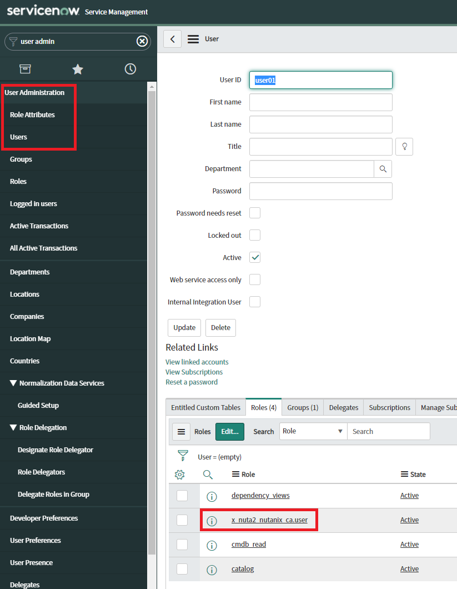
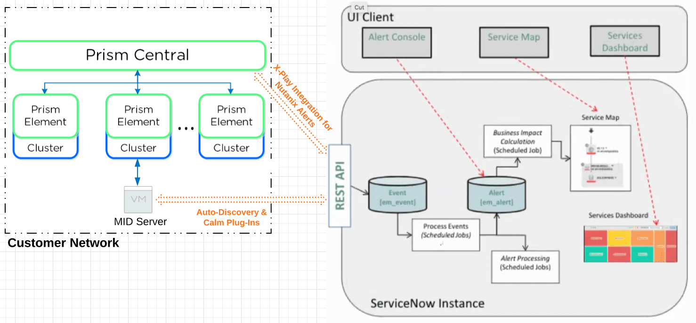
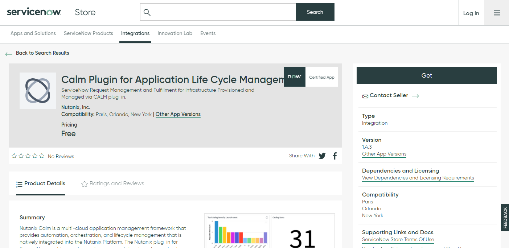

.. _snow_calm:

----------------------------
Self-Service with ServiceNow
----------------------------

As covered in other Nutanix Bootcamps, Calm and Prism Central deliver native self-service for VM provisioning by publishing Blueprints to the Calm Marketplace, and entitling certain groups of users with the ability to provision the published Blueprints.

Many organizations require additional levels of control to enforce automated or manual approvals processes over requests for virtual infrastructure - this is where ServiceNow provides additional value for Nutanix customers. In this exercise, you will show how you can integrate your Nutanix environment to allow users to request virtual infrastructure via ServiceNow.

Your Environment
++++++++++++++++

.. raw:: html

   <strong>To save time, and to ensure a consistent configuration for all users within the shared environment, your ServiceNow Developer Instance has already been pre-staged with all components necessary to complete the following exercise, including:</strong>  

Local User Accounts and Group
.............................

To integrate with LDAP, ServiceNow requires connectivity to your on-prem Active Directory environment through either VPN or utilizing a read-only Domain Controller in your network's DMZ. As this is not possible within the Nutanix Hosted POC environment, you will utilize local accounts (**operator01**, **operator02**, etc.) that have been pre-created within ServiceNow.

These local user accounts have all been added to the User Group: **Calm Users**. The group has been assigned the ServiceNow Role: **x_nuta2_nutanix_ca.user**. Users need to be assigned this specific role in order to appear within the Calm Plug-in as eligible for being assigned access to Blueprint Catalog Items.

MID Server
..........

The MID Server has been deployed on a CentOS VM via a Calm Blueprint on your **POC###** cluster.

.. figure:: images/28.png

The MID Server is a ServiceNow software package that can be installed on either Linux or Windows operating systems. As seen in the diagram below, the MID Server is responsible for facilitating communication and movement of data between the ServiceNow platform and external applications, services, or data sources, such as your Nutanix Cluster.

Nutanix Calm Plugin
....................

The `Nutanix Calm Plugin for Application Life Cycle Management <https://store.servicenow.com/sn_appstore_store.do#!/store/application/3b7631654f452b001200e5201310c76b/1.4.3?referer=%2Fstore%2Fsearch%3Flistingtype%3Dallintegrations%25253Bancillary_app%25253Bcertified_apps%25253Bcontent%25253Bindustry_solution%25253Boem%25253Butility%26q%3Dnutanix&sl=sh>`_ is a ServiceNow Certified App available for customers directly through the `ServiceNow Store <https://store.servicenow.com/sn_appstore_store.do>`_.

Automated installation via the Store requires the customer have access to their `ServiceNow HI Credentials <https://support.servicenow.com/kb?id=kb_article_view&sysparm_article=KB0781690>`_. The plugin can also be installed manually via .xml files for supporting POCs, Bootcamps, etc.

Nutanix Calm Plugin Configuration
++++++++++++++++++++++++++++++++++

#. Refer to :ref:`clusterdetails` for your **ServiceNow Instance URL** and credentials.

#. In a new browser tab, log in to your ServiceNow Developer Instance using the provided **admin** credential.

#. In the **Filter Navigator** field in the upper-left, search for **Nutanix** to access the **Nutanix Calm** application within ServiceNow.

#. Select **Application Properties**.

   .. figure:: images/1.png

#. Review the basic connectivity settings that have already been configured. The key fields required to connect the ServiceNow instance are the **Prism Central** URL, credentials, and name of the MID Server running on the Nutanix cluster.

.. raw:: html

   <strong>DO NOT EDIT ANY OF THESE VALUES.</strong>  

#. The plugin will periodically sync with Prism Central to update Blueprints, Projects, etc., however as you just created both your Project and Blueprint, you can force a sync by clicking the **Sync Now** button at the bottom of **Application Properties**. Click **OK** to begin the sync.

   .. note::

      If the UI shows that the plug-in is currently **Syncing**, you will have to wait a minute, refresh the page and click **Sync Now** once the previous sync has finished.

   .. figure:: images/5.png

   .. raw:: html

      <strong>While the sync is taking place, users may experience issues trying to create catalog items or launch Blueprints. As multiple users will be sharing a cluster and working on the lab simultaneously, you may need to re-attempt these actions if the conflict with another user beginning a sync. The sync typically only takes ~1 minute, so this should not cause any serious disruption. Take a minute to stand up from your desk, stretch, and try again!</strong>  

#. While your inventory sync is in process, return to the **Nutanix Calm > Application Properties** page.

#. Under **Configuration > Approval Workflow**, click the **Preview this record** icon and **Open Record** in the subsequent popup.

   .. figure:: images/2.png

#. Under the **Name** column, click **Nutanix Calm - User Approval**.

#. Under **Related Links**, click **Show Workflow**. This will open the Workflow Editor in another tab.

   .. raw:: html

      <strong>DO NOT MAKE CHANGES TO THIS WORKFLOW. It is a shared policy for all users on your cluster.</strong>  

   .. figure:: images/3.png

#. In the Workflow Editor, double-click the **Approval - User** stage and review the configuration.

   .. figure:: images/4.png

   By default, the Nutanix Calm plugin creates a policy named **Nutanix - Auto Approve**, which as its name implies, automatically approves all incoming Blueprint launch requests. In this environment, the pre-staged **Nutanix Calm - User Approval** flow provides a simple example of inserting business logic and approvals into a VM or application request - requiring the **admin** user to approve a Blueprint launch request before the VM or application will be provisioned.

#. Expand and explore the different options in the **Core** tab.

   Through a combination of branching, conditional logic, and LDAP user groups, Alex could design an approval flow for their Nutanix integration that allowed small or infrequent requests automatically, and layered on appropriate checks and balances for more advanced requests - for example, requiring Director level approval for all VM requests that exceed a per VM or per user memory threshold - that's the power of ServiceNow + Calm!

#. Close the **Workflow Editor**.

#. In **ServiceNow > Nutanix Calm**, browse the **Inventory Sync** section and verify your project and Blueprint are available.

   .. figure:: images/6.png

   .. note::

      If your Blueprint does not appear. Log out of the ServiceNow instance, clear your cache (or use Incognito), and log into ServiceNow again. Retry the **Sync Now** operation on the **ServiceNow > Nutanix Calm > Configuration > Application Properties** page.

   Now you're ready to create your first service offering!

Creating Catalog Items
++++++++++++++++++++++

#. In **ServiceNow > Nutanix Calm > Catalog Management > Catalog Items**, click **New**.

   You can think of Catalog Items as being similar to publishing a Blueprint to the Calm Marketplace.

#. Select your **CentOS VM** Blueprint from the **Blueprint** dropdown menu.

   .. figure:: images/7.png

   Observe that the project is automatically configured as non-Marketplace Blueprints can only belong to a single Project. The ServiceNow plugin is capable of working with both Unpublished and Published Blueprints.

   The benefit of using a Published Blueprint would be the ability to share a single Blueprint capable of spanning multiple projects, providing more flexibility when developing Service Now catalog items.

#. Click **Choose Options**.

#. Expand **Variables > Default**, verify the **Enter your initials...** variable has the **Runtime** option enabled.

#. Click **Next Tab**.

#. Expand **Service Configuration > Default > VM Configuration**, observe that fields where **Runtime** was not enabled is the Blueprint cannot be manipulated during the Catalog Item creation process.

#. Update the **Memory Size MB** to **3072**, and then disable the **Runtime** option to prevent users from altering this value during the VM ordering process. For this Catalog Item, users would still be able to request custom vCPU values.

   .. figure:: images/8.png

#. Click **Next Tab**.

#. Expand **ROOT** and verify the **Password** field can be specified by the user during the ordering process.

#. Click **Next Tab**.

#. Fill out the following fields:

   - **Item Name** - **USER**\ *##* CentOS - 3GB (ex. USER01 CentOS - 3GB)
   - Click **Assign Local Groups**
   - Specify the **Calm Users** group

   .. figure:: images/9.png

   .. note::

      As a reminder, these are LOCAL users within the ServiceNow instance due to not being able to integrate with LDAP within the lab environment. In a production environment you would entitle which AD groups you wanted to have permission to view and deploy this Blueprint. Similarly, you would provide that group with an appropriate RBAC role in Prism to allow those users to view and manage their VMs after they've been provisioned.

#. Click **Checkout**.

#. Return to **ServiceNow > Nutanix Calm > Catalog Management > Catalog Items** and verify your Catalog Item appears.

   .. note::

      It may take up to 2 minutes before your Catalog Item is listed as **Active**, this is normal. You will need to refresh the page for the record to appear.

.. Adding Calm Blueprints to Service Catalog
   +++++++++++++++++++++++++++++++++++++++++

   While users entitled to launch Calm Blueprints can access the Calm plugin menu through ServiceNow, you can also easily present the Blueprint Catalog as part of the Self-Service Portal interface that users are most familiar with for making hardware, software, services, etc. requests via ServiceNow.

   #. In the **Filter Navigator** field in the upper-left, search for **Service Catalog** and select **Service Catalog** beneath **Self-Service**.

      .. figure:: images/10.png

   #. Click the **+ Add Content** icon in the upper-right.

      .. figure:: images/11.png

   #. Search for the default **Blueprints** catalog and select an **Add here** option based on your preferred placement.

      .. figure:: images/12.png

   #. Once added to the Service Catalog, you can drag the catalog to your preferred location.

      .. note::

         The name, description, and icon of the catalog are all easily changeable, but we will use the defaults for this exercise as the change would impact others on your cluster and ServiceNow instance.

         Additionally, the Blueprints catalog can be nested inside of other categories within the Service Catalog, for example, providing a Virtual Machines catalog underneath Hardware or an Applications category underneath Software.

Ordering VMs
++++++++++++

With your Catalog Item active, you're ready to test ordering your first VM as an end user.

#. From the **System Administrator** drop down menu in the upper-right, click **Logout**.

   .. figure:: images/13.png

   .. note::

      As administrator, you can also simply **Impersonate User** for your **operator**\ *##* account from this menu, which is faster than logging in/out as multiple users.

#. Log back in using the following credentials:

   - **User name** - *Your operator## account* (ex. operator01)
   - **Password** - nutanix/4u

#. In the **Filter Navigator** field in the upper-left, search for **Launch Blueprint** to access the **Nutanix Calm** application within ServiceNow.

   .. figure:: images/31.png

   Note as a user you do not have the ability to define new catalog items, sync the Calm inventory, etc.

   .. note::

      As all users are part of the local **Calm Users** group in the ServiceNow Developer Instance, you should expect to see other users' Catalog Items listed alongside your own. In a production environment you could use LDAP to enforce individually users only seeing the Blueprint Catalog Items which they have been assigned.

#. Expand **Category: Un-Published Blueprints**, and under the **Name** column, click your **USER**\ *##*\ **CentOS - 3GB** entry to begin the user request.

#. Click **Launch**.

#. Fill out the following fields:

   - **Name of the application** - USER\ *##*\ -SnowReq1 (ex. USER01-SnowReq1)
   - **Enter your initials** - USER\ *##* (ex. USER01)
   - **VM Configuration > Sockets** - *Change from default if desired*
   - **VM Configuration > Network Adapters** - *Leave default*
   - **ROOT > Password** - nutanix/4u

#. Click **Order Now**.

#. In your **Order Status**, expand the **Stage** and observe the request is currently pending approval.

   .. figure:: images/15.png

   You can also validate with **Calm > Applications** that your **USER**\ *##*\ **-SnowReq1** application has not begun provisioning.

   .. figure:: images/16.png

#. Log out of your **user##** account and log back in as **admin** (or **operator**\ *##*\ **> End Impersonation** from the upper toolbar).

#. As **admin**, type **My Approvals** in the **Filter navigator** and select **Self-Service > My Approvals**.

   .. figure:: images/17b.png

#. Click **Created** to sort descending and identify your request.

#. Click your user request and expand the description to see the full details of the request.

#. Click **Approve**.

   .. figure:: images/18.png

#. You can view progress in a number of ways, including logging back in as your **operator**\ *##* user and viewing **ServiceNow > Nutanix Calm > Tracking > Orders**, or directly through Prism Central.

   .. figure:: images/19.png

   In a production ServiceNow environment, the user would receive updates on their request ticket via e-mail (and potentially through additional integrations like Slack).

   .. note::

      If you do not see your Blueprint being provisioned, do the following to determine the source of your error:

      - Log-in/impersonate your **operator**\ *##* account in **ServiceNow**
      - Open **Service Now > Nutanix Calm > Tracking > Incidents** and click the **INC#######** record
      - Under **Activities**, open **Incident attachment.txt** and review the error message.

         .. figure:: images/33.png

         The most common cause is leading or trailing whitespace in the naming of the **USER**\ *##*\ **-SnowReq1**.

      - Go to **Launch Blueprint** and try again

#. The Calm plugin also provides built-in dashboards for both admins and users to easily visualize key metrics relevant to the Calm integration.

   .. figure:: images/21.png

#. Once the app is provisioned, you can allow users to access and manage their VMs directly through Prism Central based on their Project entitlements. Try it out by logging into Prism Central as:

   - **Username** - operator\ *##*\ @ntnxlab.local (ex. operator01@ntnxlab.local)
   - **Password** - nutanix/4u

   Based on your Calm **Operator** role for the project, you should have the ability to manage your application, including power operations, viewing metrics, and accessing VM consoles - without the ability to view, modify, or launch Blueprints.

   .. figure:: images/20.png

   Prism Central RBAC policy could be additionally configured to restrict other non-Calm access for the cluster, such as creating new VMs from Disk Images.

Takeaways
+++++++++

- The Nutanix Calm plugin for ServiceNow provides easy integration between the two products, allowing customers to take advantage of Nutanix Calm for provisioning and app lifecycle while leveraging the sophisticated self-service engine provided by ServiceNow
